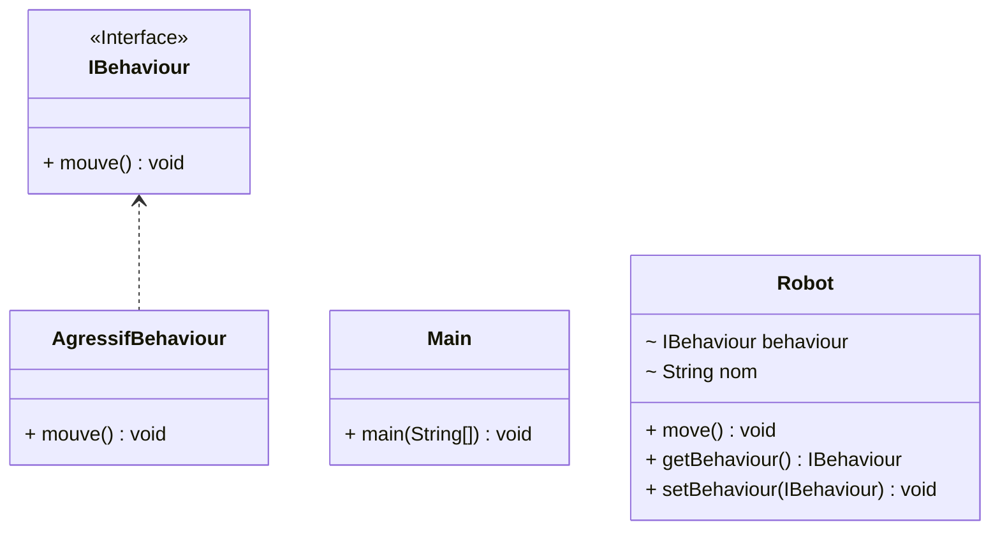

```mermaid

classDiagram
direction BT
class AgressifBehaviour {
  + mouve() void
}
class IBehaviour {
<<Interface>>
  + mouve() void
}
class Main {
  + main(String[]) void
}
class Robot {
  ~ IBehaviour behaviour
  ~ String nom
  + move() void
  + getBehaviour() IBehaviour
  + setBehaviour(IBehaviour) void
}

AgressifBehaviour  ..>  IBehaviour 
```